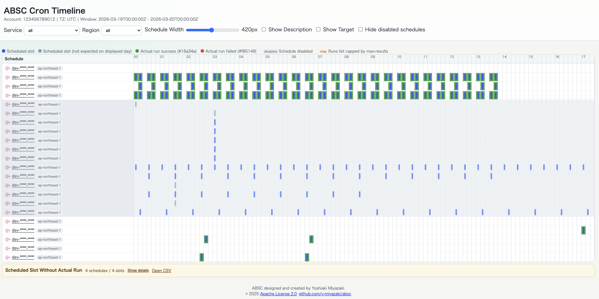

# ABSC - AWS Batch Schedule Collector


[](https://github.com/y-miyazaki/absc/releases/latest)
[](https://github.com/y-miyazaki/absc/actions/workflows/cd-wd-go-releaser.yaml)

ABSC is a command-line tool for collecting AWS cron-style schedules and rendering a schedule timeline viewer as JSON and HTML.

It focuses on scheduled workloads managed by EventBridge Rules and EventBridge Scheduler, then enriches each schedule with recent execution history when the target service supports it.

## Features

- EventBridge Rules and EventBridge Scheduler collection across multiple regions
- Event-pattern-based EventBridge Rules collection with run enrichment
- Timeline-oriented HTML output for one-day schedule visibility
- Trigger type column (Cron/Event) in the HTML viewer for schedule classification
- JSON output for automation or secondary processing
- Target service detection for Lambda, ECS, Batch, Glue, Step Functions, and more
- Recent run enrichment for Step Functions, Batch, ECS, Glue, and Lambda
- Timezone-aware rendering for schedule windows and execution timestamps
- Concurrent collection with configurable lookback range and result limits

## Screenshots

### Interactive HTML Viewer

ABSC generates an interactive HTML viewer that allows you to browse collected schedules with ease:



*Interactive HTML viewer showing AWS cron schedules and recent executions*

## Table of Contents

- [Installation](#installation)
- [Quick Start](#quick-start)
- [Usage](#usage)
- [Screenshots](#screenshots)
- [Collected Data](#collected-data)
- [Output Format](#output-format)
- [Configuration](#configuration)
- [Examples](#examples)
- [Development](#development)
- [Contributing](#contributing)
- [License](#license)

## Installation

### Using Go Install

```bash
go install github.com/y-miyazaki/absc/cmd/absc@v1.0.13
```

### Using Release tar.gz

You can download a prebuilt release tarball from the Releases page and install it quickly. The examples below use the `v1.0.13` release.

Available platforms:

- Linux (amd64, arm64)
- macOS (amd64, arm64)
- Windows (amd64)

Linux (AMD64) example:

```bash
VERSION=v1.0.13 && curl -L https://github.com/y-miyazaki/absc/releases/download/${VERSION}/absc-linux-amd64.tar.gz | tar -xzf - && sudo mv absc /usr/local/bin/ && sudo chmod +x /usr/local/bin/absc
```

macOS (ARM64) example:

```bash
VERSION=v1.0.13 && curl -L https://github.com/y-miyazaki/absc/releases/download/${VERSION}/absc-darwin-arm64.tar.gz | tar -xzf - && sudo mv absc /usr/local/bin/ && sudo chmod +x /usr/local/bin/absc
```

Notes:

- The release typically ships an `absc-${VERSION}-checksums.txt` file. Verify the checksum before installing in production.
- For Windows, download the `.zip` asset from the Releases page and extract the `absc.exe` binary.
- `go install` is convenient for development. Release tarballs are preferable when you want a pinned binary such as `v1.0.13`.

### Build from Source

```bash
git clone https://github.com/y-miyazaki/absc.git
cd absc
go build -o absc ./cmd/absc
```

### Verify Installation

```bash
absc --help
```

## Quick Start

1. Configure AWS credentials.

```bash
aws configure
```

2. Generate a schedule timeline.

```bash
absc --timezone Asia/Tokyo
```

3. Open the generated output.

```bash
ls -lh ./output/*/schedules/
```

The main artifacts are generated under `./output/{account-id}/schedules/`.

In the generated HTML viewer and errors page, the account header is displayed as `accountName(accountID)` when AWS Account metadata is available.

## Usage

### Basic Commands

```bash
# Collect schedules in the default region
absc

# Collect schedules from multiple regions
absc --region ap-northeast-1,us-east-1

# Use a specific AWS profile
absc --profile production

# Render in a specific timezone
absc --timezone Asia/Tokyo

# Select an older calendar day window
absc --days-ago 3

# Increase collector concurrency
absc --max-concurrency 10

# Limit the number of collected runs per target
absc --max-results 100

# Write to a custom output base directory
absc --output-dir /path/to/output
```

`--days-ago` selects a calendar-day window in the chosen timezone (`0=today`, `1=yesterday`, `2=two days ago`). ABSC always anchors the display and CloudTrail collection window to that day's `00:00:00` and collects exactly one day (`00:00:00` to `24:00:00`).

See [docs/SPECIFICATION.md](docs/SPECIFICATION.md) for the exact timeline window model.

### Command-Line Options

```text
OPTIONS:
   --profile value             AWS profile to use
   --region value, -r value    AWS region(s) to use (comma-separated list accepted) (default: "ap-northeast-1")
   --regions value             Deprecated alias of --region
   --timezone value            IANA timezone (default: "UTC")
   --output-dir value, -D      Output base directory (default: "./output")
  --days-ago value            Calendar day offset (0=today, 1=yesterday) (default: 1)
   --max-concurrency value     Max concurrent resource collectors (default: 5)
    --max-results value         Max executions/jobs per target (default: 144)
   --help, -h                  show help
```

## Collected Data

### Schedule Sources

ABSC currently collects schedules from the following AWS sources:

- EventBridge Rules with schedule expressions (cron/rate)
- EventBridge Rules with event patterns (event-triggered)
- EventBridge Scheduler schedules

### Target Classification

ABSC classifies targets for display in the HTML timeline. Common target services include:

- Lambda
- ECS
- Batch
- Glue
- Step Functions
- EC2
- RDS
- Redshift
- EventBridge
- Other

### Execution History Enrichment

Run enrichment is action-capability based for known target kinds. Primary measurable actions use service-native history sources, and other known actions fall back to CloudTrail request history. Current native runtime coverage is:

- Step Functions executions
- AWS Batch jobs
- ECS task runs
- Glue job runs
- Lambda invocations derived from CloudWatch Logs

Additional CloudTrail-backed request history is used for:

- Non-primary actions on Lambda, ECS, Batch, Glue, and Step Functions targets
- Request-oriented actions for EC2, RDS, and Redshift targets

ECS note:

- ECS stopped task history from ECS APIs is short-lived (approximately 1 hour).
- ABSC backfills older ECS schedule windows by reading CloudTrail management events (`RunTask`) and merges them with ECS API results.

CloudTrail-backed runs use request-oriented statuses such as `UPDATE_REQUESTED` and `ACTION_REQUESTED`; they indicate that ABSC observed the action request, not that the service exposes authoritative execution duration.

If a target type is not supported for run enrichment, the timeline still shows scheduled slots, but the run list remains empty. ABSC does not apply a generic CloudTrail fallback to unknown target kinds.

Disabled schedules keep previously executed runs inside the lookback window so the timeline can still show recent actual activity.

## Output Format

### Directory Structure

```text
output/
└── {account-id}/
  └── schedules/
        ├── index.html
        ├── schedules.json
        └── assets/
            └── icons/
                └── *.svg
```

### JSON Output

`schedules.json` contains:

- Metadata such as account ID, optional account name, timezone, generation time, and timeline window
- Schedule definitions collected from EventBridge Rules and Scheduler
- Recent run history for supported target services
- Error records grouped by service and region

### HTML Viewer

`index.html` is a self-contained timeline viewer backed by the same JSON payload. It provides:

- Account metadata shown as `accountName(accountID)` when available
- Service and region filters
- Trigger type column showing Cron expression or Event rule name
- Sticky schedule name column
- 10-minute slots across a 24-hour window
- Scheduled slot markers and actual run overlays
- Disabled schedule highlighting
- Success/failed run coloring in overlays and tooltip statuses
- Maximum-result cap indicator when runs are truncated
- Tooltip timezone metadata for each schedule:
  - `expression timezone` (for example, `Asia/Tokyo (UTC+09:00)`)
  - `display timezone` (the CLI timezone used for rendering, for example `UTC`)

The HTML file can be opened directly in a browser because the payload is embedded into the document.

## Configuration

### Environment Variables

- `AWS_PROFILE` - AWS profile name
- `AWS_DEFAULT_PROFILE` - Alternate AWS profile environment variable
- `AWS_DEFAULT_REGION` - Default AWS region
- `AWS_ACCESS_KEY_ID` - AWS access key
- `AWS_SECRET_ACCESS_KEY` - AWS secret key
- `AWS_SESSION_TOKEN` - AWS session token for temporary credentials

### AWS Permissions

ABSC requires read-only access for the schedule sources and the target services whose execution history you want to inspect.

For normal ABSC usage, it is safer to start with a single base policy like this:

```json
{
  "Version": "2012-10-17",
  "Statement": [
    {
      "Sid": "ReadScheduleDefinitionsAndAccountMetadata",
      "Effect": "Allow",
      "Action": [
        "account:GetAccountInformation",
        "sts:GetCallerIdentity",
        "events:ListRules",
        "events:ListTargetsByRule",
        "scheduler:ListSchedules",
        "scheduler:GetSchedule"
      ],
      "Resource": "*"
    },
    {
      "Sid": "ReadExecutionHistoryForSupportedTargets",
      "Effect": "Allow",
      "Action": [
        "states:ListExecutions",
        "batch:ListJobs",
        "ecs:ListTasks",
        "ecs:DescribeTasks",
        "cloudtrail:LookupEvents",
        "glue:GetJobRuns",
        "logs:FilterLogEvents"
      ],
      "Resource": "*"
    }
  ]
}
```

If you only need schedule-definition collection and do not need run enrichment, you can remove the `ReadExecutionHistoryForSupportedTargets` statement.

If you prefer to separate permissions, the run-enrichment statement is:

```json
{
  "Version": "2012-10-17",
  "Statement": [
    {
      "Sid": "ReadExecutionHistoryForSupportedTargets",
      "Effect": "Allow",
      "Action": [
        "states:ListExecutions",
        "batch:ListJobs",
        "ecs:ListTasks",
        "ecs:DescribeTasks",
        "cloudtrail:LookupEvents",
        "glue:GetJobRuns",
        "logs:FilterLogEvents"
      ],
      "Resource": "*"
    }
  ]
}
```

Notes:

- `account:GetAccountInformation` is used to resolve the account display name shown as `accountName(accountID)` in generated HTML and error pages.
- `account:GetAccountInformation` is recommended as part of the default policy because it is easy to miss and ABSC now uses it for standard account display metadata.
- If you run ABSC from CI/CD or an assumed role, add `account:GetAccountInformation` to that role as well.
- `cloudtrail:LookupEvents` is only needed for ECS backfill when stopped-task history is outside ECS API retention.
- If you do not use run enrichment, the second policy block is not required.
- You can scope resources more tightly per service where IAM supports resource-level restrictions.

## Examples

### Multi-Region Timeline

```bash
absc --region ap-northeast-1,us-east-1 --timezone Asia/Tokyo
```

### Older Calendar Day

```bash
absc --days-ago 7 --max-results 200
```

### Separate Output by Profile

```bash
absc --profile production --output-dir ./output/production
absc --profile staging --output-dir ./output/staging
```

### CI Execution

```yaml
name: Collect AWS schedules

on:
  schedule:
    - cron: '0 0 * * *'

jobs:
  collect:
    runs-on: ubuntu-latest
    permissions:
      id-token: write
      contents: read
    steps:
      - uses: actions/checkout@v4

      - uses: actions/setup-go@v5
        with:
          go-version: '1.25.8'

      - uses: aws-actions/configure-aws-credentials@v4
        with:
          role-to-assume: arn:aws:iam::123456789012:role/GitHubActionsRole
          aws-region: ap-northeast-1

      # The assumed role should include account:GetAccountInformation
      # if you want the generated pages to show accountName(accountID).

      - name: Install absc
        run: go install github.com/y-miyazaki/absc/cmd/absc@v1.0.13

      - name: Collect schedules
        run: absc --timezone Asia/Tokyo

      - name: Upload artifacts
        uses: actions/upload-artifact@v4
        with:
          name: absc-output
          path: output/
```

## Development

```bash
go test ./...
go build ./cmd/absc
```

For repository-wide contribution guidance, see [CONTRIBUTING.md](CONTRIBUTING.md).

## Contributing

Contributions are welcome. Please review [CONTRIBUTING.md](CONTRIBUTING.md) before submitting changes.

## License

Apache License 2.0. See [LICENSE](LICENSE) for details.
